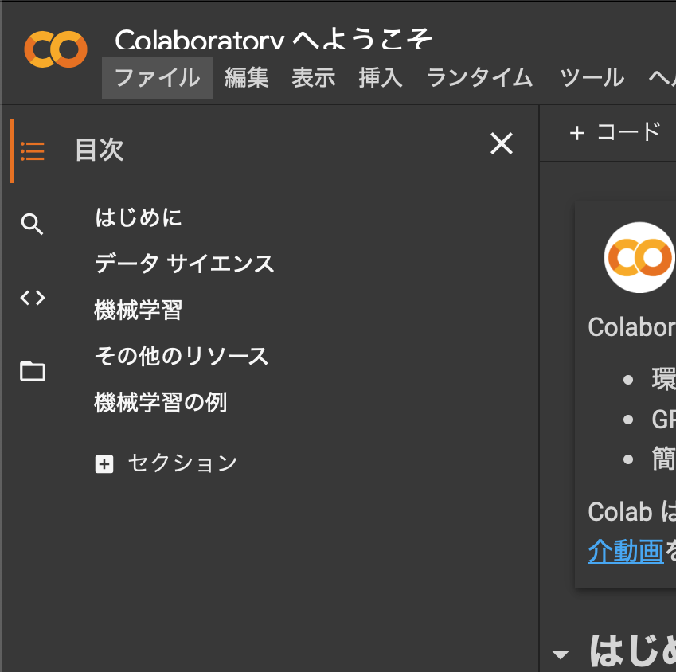
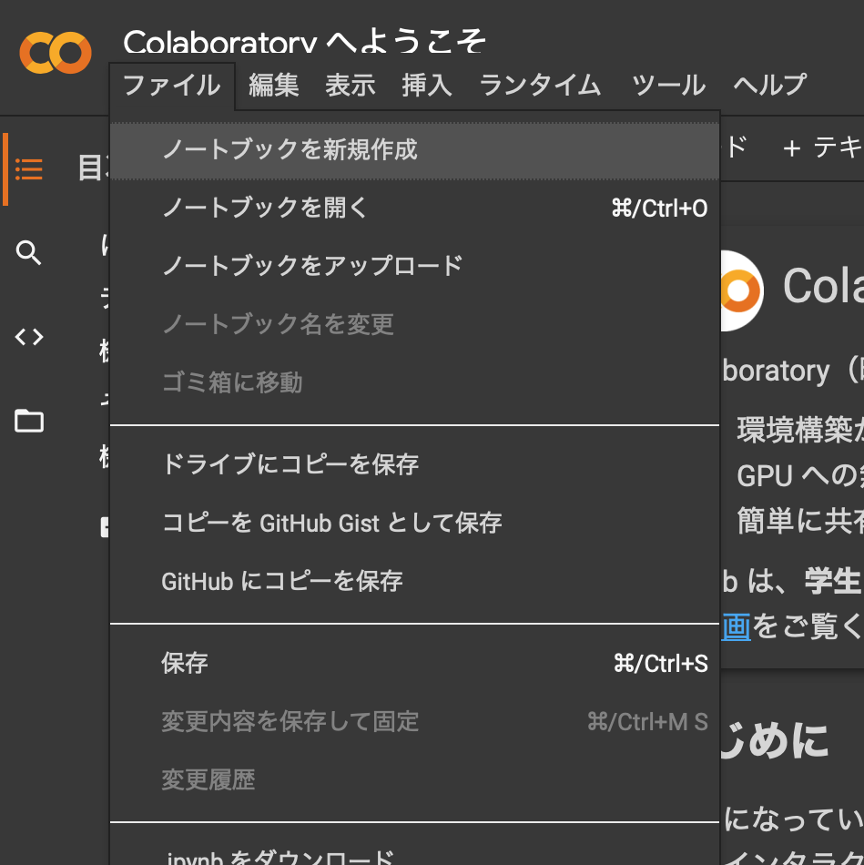
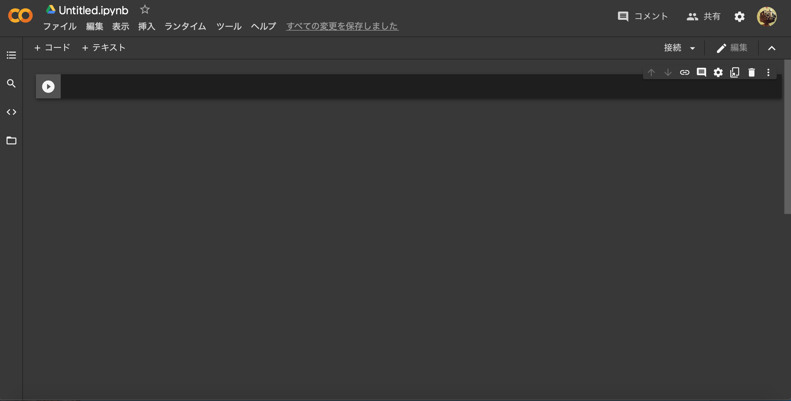
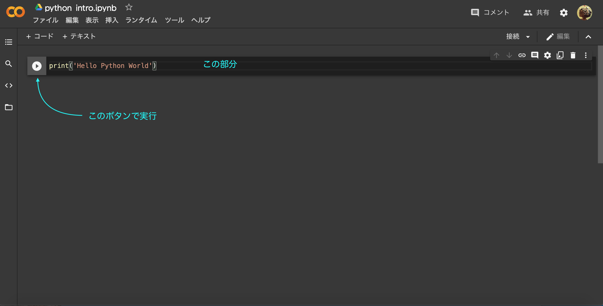

#Google Colaboratry
##Google Colabとは？
> ブラウザから*Python*を記述、実行できる。

このサイトではmacOS向けの*Python*の環境構築について説明したが、ColaboratryはWindowsやタブレット、スマートフォンなでも実行できるサービスです。Googleのアカウントが必要です。

[Google Colab](https://colab.research.google.com/notebooks/welcome.ipynb?hl=ja)より*Google Colab*にアクセスしてください。

##使い方
> *Python*コードを書いて動かしてみよう

左上の`ファイル`から`ノートブックを新規作成`をクリック。すると別タブへ移動する。

すると`Untitled.ipynb`というファイルが作成される。ついでにファイル名を`python_intro.ipynb`に変更しましょう。

##コードの記述と実行
> どこにコード書くねん

この部分にコードを記述していきます。また左側のボタンでコードを実行することができます。では初めに`print('Hello Python World')`と書いて実行してみましょう。`Hello Python World`と出力されます。

これから*Python*の基礎について学びます。説明はmacOS向けですが、*Google Colab*でも説明した方法で実行することができます。*Google Colab*ではインタラクティブモードを使うことはできません。コードを書いては実行する必要があります。

<a href="python_intro2.html">次へ(<em>Python</em>を書いてみよう)</a>

<a href="python_intro.html">前へ(始める前に)</a>

<a href="python_intro.html">初めに戻る</a>