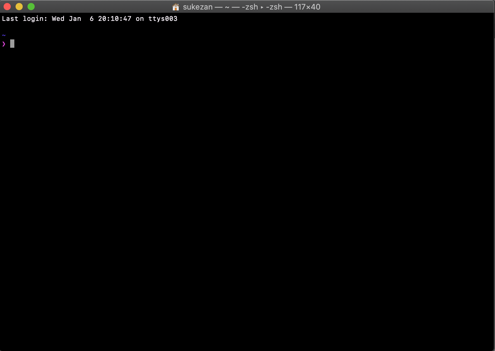
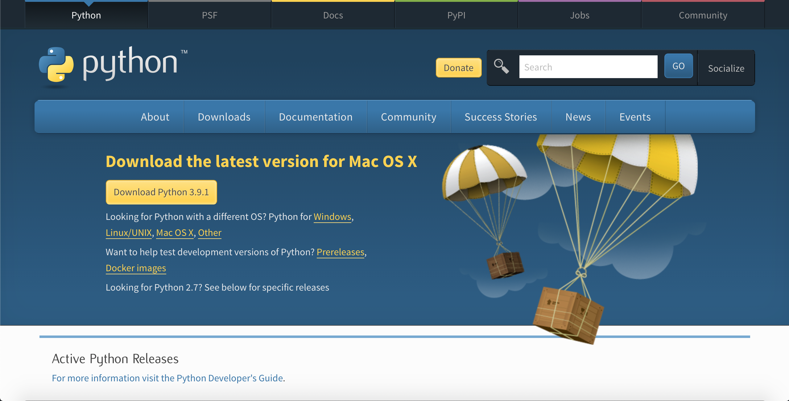

#Basic Python

##目標
このサイトではプログラミングの基礎的な知識を*Python*を用いて学ぶ。値の扱い方やアルゴリズムなどの考え方についての知識を獲得する。
##項目
- <a href="python_intro2.html">Pythonを書いてみよう</a>
- <a href="python_intro2-2.html">Pythonを書いてみよう その2</a>
- <a href="google_colab.html"><em>Google Colaboratry</em>で実行</a>
- <a href="python_intro3.html">コードエディタをインストール</a>
- <a href="python_intro5.html">Pythonで複数行のコードを記述</a>

#始める前に
##準備

###動作環境
> macOS Catalina 10.15.7 or more

これから説明する方法はmacOSを対象としています。Windowsやタブレットを利用している人(macOSも対象)は<a href="google_colab.html"><em>Google Colaboratory</em>で実行</a>を参照してください。

以下の手順でターミナル(Terminal)というアプリケーションを起動してみましょう

```:Terminal
アプリケーション → ユーティリティ → ターミナル
```



するとこのような見たことのない画面が出てくると思いますがまずは落ち着いてゆっくり進めましょう(環境によって表示されている画面が違う場合があります）

実はMacにはPythonが標準でインストールされています。
まずこの画面に`python -V`と入力して確認してみましょう。

```:Terminal
$ python -V 
Python 2.7.16
```

と表示されるはずです。（数字は環境によって異なる）
ここで表示されている2から始まる数字はバージョンを示してます。これらはPythonの2系と言われるものです。Pythonには3系のバージョンも存在します。2系はすでにサポートが終了しているので	3系を利用するようにしましょう。

###*Python*をインストール
> pkgファイルをダウンロード、実行してPythonをインストール

[Python downloads](https://www.python.org/downloads/)

*Download Python 3.9.1*からダウンロードする。

インストールファイルを開いて、基本的には"続ける"を押して進めばインストールされるはずです。インストールが終わればターミナルで以下のコマンドを打ち込んでインストールされているか確認してください。

```:Terminal
$ python3 -V
Python 3.9.1
```
自身がダウンロードしたpythonのバージョンが表示されていれば成功です。

次の章では実際にPythonプログラムを書いていきましょう。

<a href="python_intro2.html">次へ(Pythonを書いてみよう)</a>

<a href="python_intro.html">初めに戻る</a>