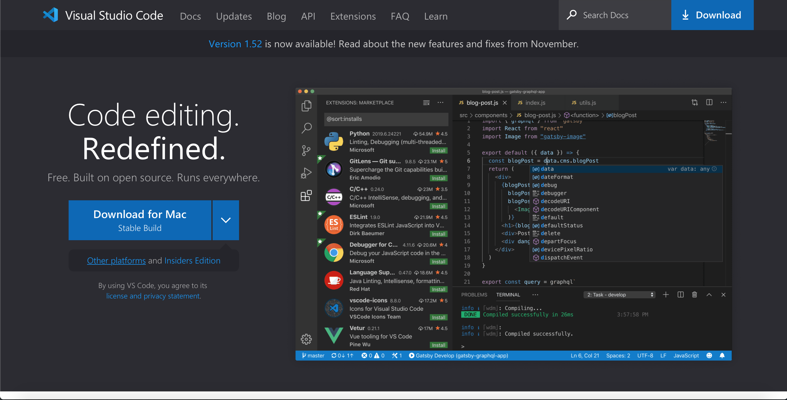
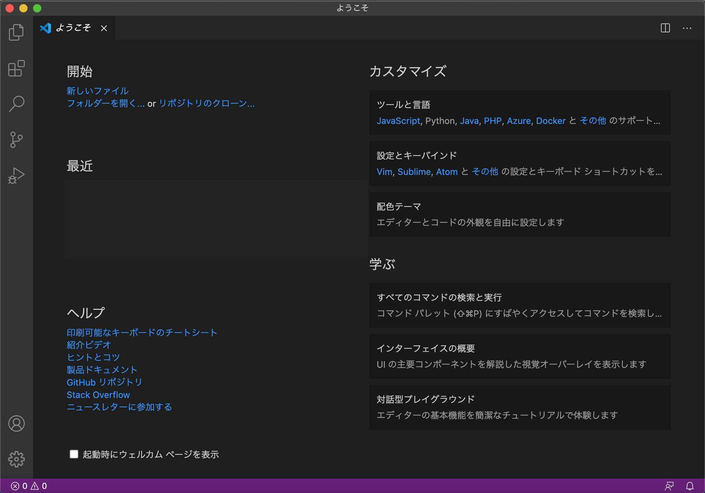
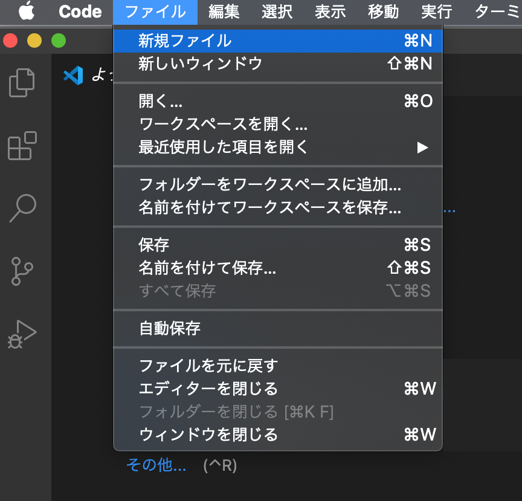

#コードエディタをインストール

###コードエディタとは?
> コードを書ける環境を整えよう

プログラムを編集することに特化したテキストエディタです。 
多くのエディタがあるが今回は*Visual Studio Code*をおすすめします。

###*Visual Studio Code*をインストール
> Microsoftが提供しているコードエディタを使う

[Download for Mac](https://code.visualstudio.com)よりダウンロード

ダウンロードしたzipファイルを解凍すると、アプリのアイコンが表示されます。
そのアイコンを*アプリケーション*フォルダに移動させて、起動します。その際、「開発元が未確認のため開けません」と表示される可能性があります。

####「開発元が未確認のため開けません」という警告が表示された場合
>  App Storeに登録されていないアプリケーションを開こうとすると表示される

1. MacのFinder  で、開きたいアプリケーションを検索します。 
Launchpadは使用しないでください。Launchpadではショートカットメニューにアクセスできません。
2. Controlキーを押しながらアプリケーションアイコンをクリックして、ショートカットメニューから「開く」を選択します。
3. 「開く」をクリックします。 
アプリケーションはセキュリティ設定の例外として保存され、今後は登録済みのアプリケーションと同様に、ダブルクリックすることで開くことができるようになります。

#####参考

[開発元が未確認のMacアプリケーションを開く](https://support.apple.com/ja-jp/guide/mac-help/mh40616/mac)

###*Visual Studio Code*を使ってみよう

(私は日本語化ソフトを入れているので日本語が表示されています。初期画面は英語のはずです。)

File → New File(新規ファイル) よりコードを書き始めることができます。 
では次の章では実際にプログラムを記述していきます。

<a href="python_intro4.html">次へ(スクリプトファイルから実行)</a>

<a href="python_intro2-2.html">前へ(Pythonを書いてみよう その2)</a> 

<a href="python_intro.html">初めに戻る</a>