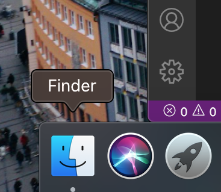
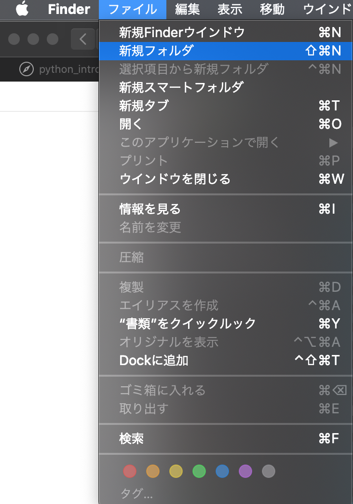
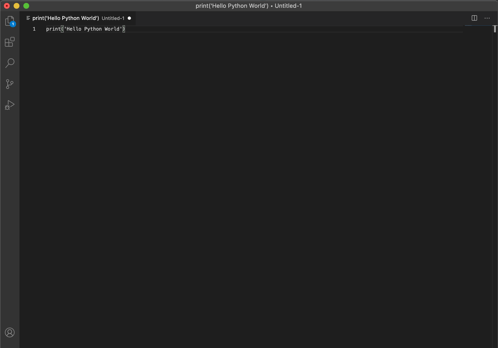
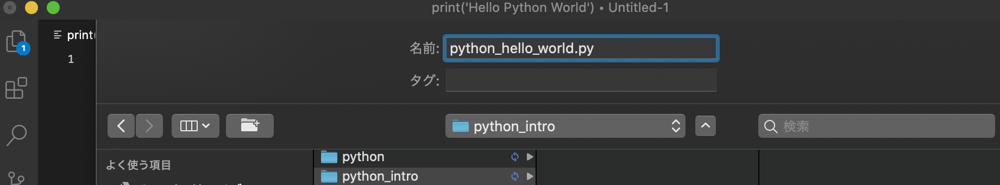
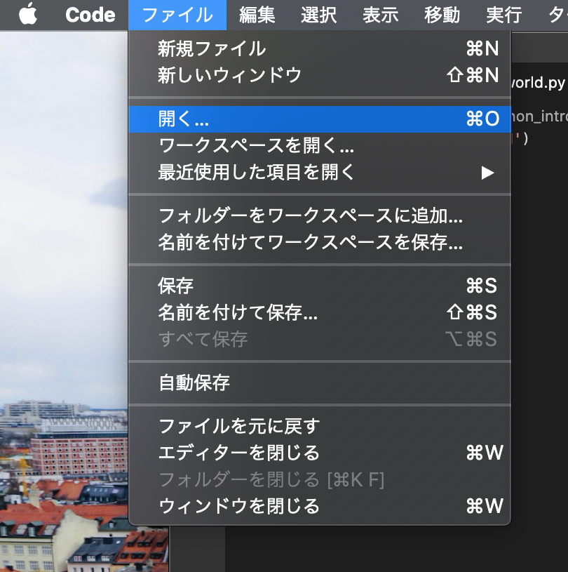
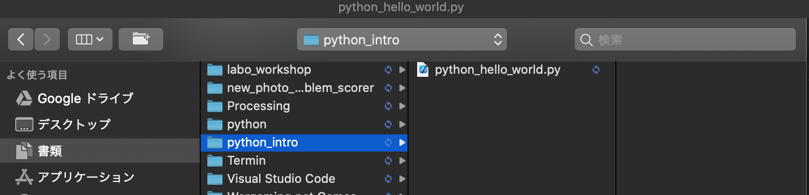
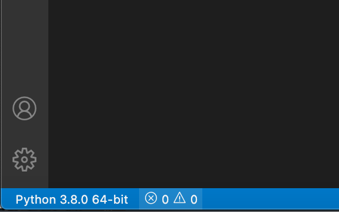
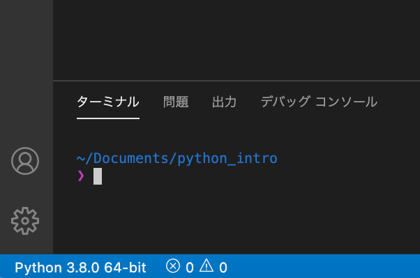
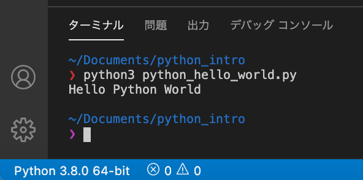

#スクリプトファイルから実行
##スクリプトとは？
> ファイルにプログラムを記述しよう

インタラクティブモードではコードを逐次的に実行できます。しかし、プログラムは普通、スクリプト(Script)にコードを記述して実行します。スクリプトとはソースコードが書かれたすぐに実行できるプログラムのことをいいます。

###場所を確保しよう
> ファイルの場所はまとめておきましょう

*Finder*から自分の任意の場所にフォルダを作ります。




今回は`書類(Documents) → python_intro`というフォルダを作りましょう。


###スクリプトを記述してみよう
> インタラクティブモードとの違いとは？

ファイルにプログラムを記述していきましょう。まず新規ファイルに以下のコードを書いてください。

```:Terminal
print('Hello Python World')
```


ファイルにコードが書けたら、`File(ファイル) → Save(保存)`からファイル名を`python_hello_world.py`にしましょう。<br>※ファイル名の最後は必ず`.py`をつけましょう。このファイルが*Python*を書いたものだと知らせるため。

保存先は先ほど作成したフォルダに保存しましょう。



これで*Python*のファイルが完成しました。




そして、`File(ファイル) → Open(開く)`から`python_intro`フォルダを開いてください。




ウィンドウの下の部分にある`×0!0`のボタンを押して`Terminal(ターミナル)`を押してください。するとターミナルが*Visual Studio Code*上で開くことができます。ターミナルでファイルを実行しましょう。



```:Terminal
$ python3 python_hello_world.py
Hello Python World
```
このように表示されれば正解です。このように`$ python3 ファイル名.py`でファイルを実行することができます。インタラクティブモードの回で学んだコードも書いて試してみてください。

###まとめ
- *Finder*よりフォルダを作成してファイルの場所を決める
- `.py`で*Python*スクリプトを作成
- `python3 ファイル名.py`でスクリプト実行

<a href="python_intro5.html">次へ(Pythonで複数行のコードを記述)</a>

<a href="python_intro3.html">前へ(コードエディタをインストール)</a>

<a href="python_intro.html">初めに戻る</a>